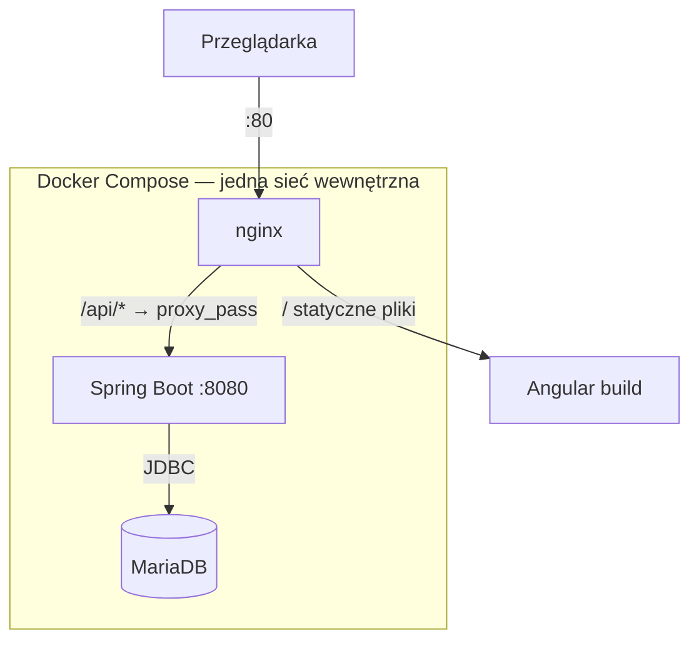

# Book Library API

**Żywa aplikacja:** [afterword.coffe.ink](http://afterword.coffe.ink)

Osobisty katalog książek — aplikacja do śledzenia przeczytanych, czytanych i planowanych do przeczytania książek. Projekt nauki: REST API + SPA + konteneryzacja, budowane od zera z naciskiem na zrozumienie każdej warstwy, nie tylko "działający kod".

## Stack technologiczny

| Warstwa | Technologia |
|---|---|
| Backend | Spring Boot 4.1, Java 25, raw JDBC (`NamedParameterJdbcTemplate`, celowo bez JPA) |
| Migracje bazy | Flyway |
| Baza danych | MariaDB (prod), H2 in-memory (dev) |
| Frontend | Angular 22, standalone components, Signal Forms, sygnały jako mechanizm stanu |
| Serwer statyczny / reverse proxy | nginx |
| Konteneryzacja | Docker, Docker Compose (multi-stage buildy) |
| Hosting | Oracle Cloud Free Tier (Ampere A1, Ubuntu 24.04) |
| CI lokalny | Maven, npm |

## Architektura

Monorepo: `backend/` (Spring Boot) + `frontend/` (Angular), jeden `docker-compose.yml` w korzeniu spinający oba z bazą danych.



**Kluczowa decyzja:** tylko `frontend` (nginx) ma wystawiony port na zewnątrz. `backend` i `mariadb` są osiągalne wyłącznie wewnątrz sieci Docker Compose — nikt z internetu nie łączy się z nimi bezpośrednio. Frontend rozmawia z `/api/*`, a nginx po cichu przekierowuje to do `backend:8080` przez wewnętrzny DNS Compose (nazwa serwisu = nazwa hosta).

## Struktura warstw backendu
Controller → Service → Repository → baza danych
- **Controller** — mapowanie HTTP ↔ DTO, walidacja kształtu danych (`@Valid`, `@Min`). Nie zawiera logiki biznesowej.
- **Service** — logika biznesowa i reguły domenowe (sprawdzanie duplikatów, walidacja `timesRead`/`status`). Nie wie nic o HTTP.
- **Repository** — jedyna warstwa dotykająca SQL. Rzuca wyjątki domenowe (`BookNotFoundException`, `ApiException`), nie zna HTTP.

Rozdzielenie to nie jest formalność — każda warstwa da się przetestować i zmienić niezależnie od pozostałych (stąd `BookServiceImplTest` mockuje repozytorium, nie dotyka bazy).

## Troubleshooting — nietypowe problemy napotkane po drodze

Rzeczy, na które trafi każdy powtarzający tę konfigurację od zera:

- **IntelliJ po reorganizacji do monorepo** — jeśli przenosisz kod do podfolderu (`backend/`), stary moduł IntelliJ "pamięta" poprzednią strukturę i zgłasza `Java file is located outside of the module source root`. Rozwiązanie: zamknij projekt, otwórz **konkretnie** `backend/` jako osobny projekt (nie korzeń repo).
- **`npm install`/`npm run build` w złym katalogu** — uruchomione w korzeniu repo zamiast `frontend/` tworzy błędny `package.json` w złym miejscu. Zawsze sprawdź `pwd` przed komendami npm.
- **Grupa `docker` na CachyOS/Arch** — po `usermod -aG docker $USER` samo otwarcie nowego terminala **nie wystarcza**. Wymagane pełne wylogowanie z sesji graficznej (albo restart), inaczej `docker ps` zwraca `permission denied`.
- **`host.docker.internal` na natywnym Linuksie** — w przeciwieństwie do Docker Desktop (Mac/Windows), na Linuksie ta nazwa **nie działa automatycznie**. Wymaga jawnej flagi: `--add-host=host.docker.internal:host-gateway`. Dotyczy tylko ręcznych testów pojedynczych kontenerów — w `docker-compose.yml` nieaktualne (komunikacja przez nazwy serwisów).
- **`ufw` blokuje ruch z kontenerów do hosta** — domyślna polityka `deny incoming` blokuje też kontenery próbujące połączyć się z usługą uruchomioną **na hoście** (nie w Dockerze). Rozwiązanie: `sudo ufw allow from <podsieć-dockera> to any port <port> proto tcp`. Nie dotyczy `docker-compose.yml`.
- **Oracle Cloud Free Tier — "Out of capacity"** — Ampere A1 to popularny, ograniczony darmowy zasób. Brak wolnej pojemności w danym Availability Domain to normalne, nie błąd konfiguracji. Rozwiązania: ponawianie prób ręcznie, automatyzacja przez OCI Cloud Shell, albo (jak w tym projekcie) po prostu cierpliwość — w końcu się udaje.
- **`.gitignore` i `echo >> `** — dopisywanie linii do `.gitignore` przez `echo "wzorzec" >> .gitignore` może **skleić się** z poprzednią linią, jeśli plik nie kończył się znakiem nowej linii, tworząc jeden błędny, złożony wzorzec zamiast dwóch osobnych. Zawsze weryfikuj `cat .gitignore` po takiej zmianie, nie tylko `git status`.

## Obsługa błędów

Trzy osobne wyjątki domenowe, bez znajomości HTTP — `GlobalExceptionHandler` (`@RestControllerAdvice`) mapuje je na kody statusu:

| Wyjątek | HTTP | Kiedy |
|---|---|---|
| `BookNotFoundException` | 404 | Książka o podanym `id` nie istnieje |
| `DuplicateBookException` | 409 | Ta sama para title+author już istnieje (przy POST bez `allowDuplicate=true`, lub przy PATCH gdy inna książka ma taki sam title+author) |
| `InvalidTimesReadException` | 400 | `timesRead` ujemne, lub `status=FINISHED` z `timesRead<=0` |
| `ConstraintViolationException` | 400 | `page`/`pageSize` poza dozwolonym zakresem |
| Walidacja `@Valid`/`@NotBlank`/`ValidIsbn` | 400 | Nieprawidłowy kształt danych w body żądania |
| `ApiException` | 500 | Nieoczekiwana awaria infrastruktury (baza padła, itp.) — **jedyny** przypadek 500 w tym API |

Zasada projektowa: repozytorium i serwis rzucają wyjątki **bez wiedzy o HTTP** — mapowanie na kod statusu dzieje się wyłącznie w `GlobalExceptionHandler`.

## Referencja API

Bazowy URL: `/` (dev: `http://localhost:8080`, prod: przez nginx `/api`)

| Metoda | Ścieżka | Opis |
|---|---|---|
| `POST` | `/books?allowDuplicate=false` | Tworzy książkę. 409 przy duplikacie, chyba że `allowDuplicate=true` |
| `GET` | `/books/{id}` | Pobiera jedną książkę |
| `GET` | `/books?page=0&pageSize=20` | Lista paginowana |
| `PATCH` | `/books/{id}` | Częściowa aktualizacja — pola pominięte/`null` pozostają bez zmian |
| `DELETE` | `/books/{id}` | Usuwa książkę, zwraca 204 |

Pełne kontrakty (request/response, przykłady) — patrz `PROGRESS.md`.

## Model danych

Tabela `books` (schemat: `backend/src/main/resources/db/migration/V1__create_books_table.sql`):

| Kolumna | Typ | Uwagi |
|---|---|---|
| `id` | `BIGINT AUTO_INCREMENT` | Klucz główny |
| `title`, `author` | `VARCHAR(255) NOT NULL` | Wymagane |
| `isbn` | `VARCHAR(20) UNIQUE` | Opcjonalne, walidowane checksumą (ISBN-10/13) gdy podane |
| `status` | `VARCHAR(20) NOT NULL` | `TO_READ`, `READING`, `FINISHED` |
| `start_date`, `finish_date` | `DATE` | Oba opcjonalne, niezależnie od statusu |
| `times_read` | `INT NOT NULL DEFAULT 0` | Liczba przeczytań |
| `notes` | `TEXT` | Opcjonalne |

**Reguły biznesowe (w `BookServiceImpl`, nie w bazie):**
- Duplikat = ten sam `title`+`author`, case-insensitive. Sprawdzany przy `POST` (pomijalny przez `allowDuplicate=true`) i `PATCH` (z pominięciem własnego `id`)
- `timesRead` nigdy ujemne
- `status=FINISHED` wymaga `timesRead > 0`
- Brak ograniczenia `UNIQUE(title, author)` na poziomie bazy — celowe, duplikat bywa pożądany (dwa wydania, ponowny zakup)

## Frontend — architektura komponentów

- **Stan współdzielony przez `BookService`** (nie przez każdy komponent osobno) — sygnały `books`, `currentPage`, `totalPages` żyją w jednym miejscu, komponenty je **czytają**, serwis jest jedynym, który je **zmienia**. Dzięki temu np. dodanie książki w `AddBookForm` automatycznie odświeża listę w `BookList`, bez ręcznej synchronizacji.
- **Komunikacja rodzic-dziecko:** `input.required<T>()` / `output<void>()` (nowoczesny odpowiednik `@Input`/`@Output` w Angularze 22) — używane przez `EditBookForm` osadzony w wierszach `BookList`.
- **Formularze:** Signal Forms (`form()`, `FormField`, `required()`, `min()` z `@angular/forms/signals`) — nie klasyczne Reactive Forms.
- **Zmiana wykrywania (change detection):** nowe komponenty domyślnie `OnPush` — stan **musi** być trzymany w `signal()`, zwykłe przypisanie pola nie odświeży widoku.

## Uruchomienie lokalnie

### Opcja A — bez Dockera (rozwój dnia codziennego)

Backend (profil dev, H2 in-memory, dane testowe przez `DevDataSeeder`):
```bash
cd backend
./mvnw spring-boot:run
```

Frontend:
```bash
cd frontend
npm install
ng serve
```

Aplikacja dostępna pod `http://localhost:4200`, API pod `http://localhost:8080`.

### Opcja B — przez Docker Compose (weryfikacja konfiguracji produkcyjnej)

```bash
docker compose up --build
```

Aplikacja dostępna pod `http://localhost` (port 80), backend i baza osiągalne tylko wewnątrz sieci Compose. Wymaga pliku `.env` w korzeniu repo (patrz sekcja niżej) — plik **nie** jest w repo, trzeba go stworzyć ręcznie.

## Zmienne środowiskowe (`.env`, wymagany dla Docker Compose)

| Zmienna | Opis |
|---|---|
| `DB_ROOT_PASSWORD` | Hasło administratora MariaDB (tylko do inicjalizacji kontenera) |
| `DB_NAME` | Nazwa bazy danych (np. `bookdb`) |
| `DB_USERNAME` | Użytkownik aplikacji do bazy |
| `DB_PASSWORD` | Hasło użytkownika aplikacji |

`.env` jest w `.gitignore` — nigdy nie commitować prawdziwych haseł.

## Testowanie

```bash
cd backend
./mvnw test
```

Obejmuje: testy repozytorium na prawdziwym H2 (`@JdbcTest`), testy jednostkowe repozytorium z zamockowanym `NamedParameterJdbcTemplate`, testy serwisu z zamockowanym repozytorium (Mockito — duplikaty, `timesRead`, paginacja), testy walidatora ISBN.

## Znane ograniczenia / dalszy rozwój

Pełny, aktualny backlog — patrz `PROGRESS.md`. Skrótowo:
- PATCH nie rozróżnia "pole pominięte" od "pole ustawione na `null`" (świadome uproszczenie)
- Brak dodatkowych pól modelu (okładka, tagi, wydawca, seria) — zaplanowane, nie zaimplementowane
- Deployment na Oracle Cloud w toku — status w `DEPLOYMENT.md`