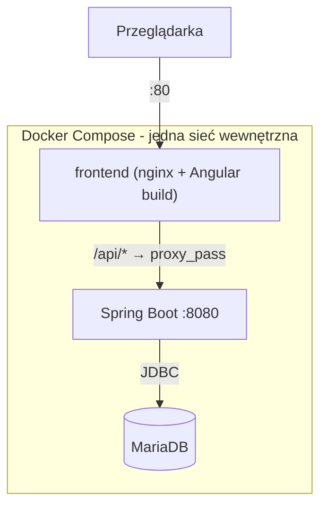

# Book Library API

**Żywa aplikacja:** [afterword.coffe.ink](https://afterword.coffe.ink)

Osobisty katalog książek - aplikacja do śledzenia przeczytanych, czytanych i planowanych do przeczytania książek. Projekt nauki: REST API + SPA + konteneryzacja, budowane od zera z naciskiem na zrozumienie każdej warstwy, nie tylko "działający kod".

## Stack technologiczny

| Warstwa | Technologia |
|---|---|
| Backend | Spring Boot 4.1, Java 25, raw JDBC (`NamedParameterJdbcTemplate`, celowo bez JPA) |
| Migracje bazy | Flyway |
| Baza danych | MariaDB (prod i dev - lokalna, trwała instancja przez Docker, patrz "Uruchomienie lokalnie") |
| Autoryzacja | JWT (jjwt), Spring Security - rejestracja, logowanie, izolacja danych per-user |
| Zewnętrzne katalogi | BN Data (Biblioteka Narodowa, główne źródło) + Google Books (wydania obcojęzyczne) |
| Frontend | Angular 22, standalone components, Signal Forms, sygnały jako mechanizm stanu |
| Szyfrowanie | HTTPS przez Let's Encrypt/Certbot (automatyczne odnawianie) |
| Serwer statyczny / reverse proxy | nginx |
| Konteneryzacja | Docker, Docker Compose (multi-stage buildy) |
| Hosting | Oracle Cloud Free Tier (Ampere A1, Ubuntu 24.04) |
| CI lokalny | Maven, npm |

## Architektura

Monorepo: `backend/` (Spring Boot) + `frontend/` (Angular), jeden `docker-compose.yml` w korzeniu spinający oba z bazą danych.




**Kluczowa decyzja:** tylko `frontend` (nginx) ma wystawiony port na zewnątrz. `backend` i `mariadb` są osiągalne wyłącznie wewnątrz sieci Docker Compose - nikt z internetu nie łączy się z nimi bezpośrednio. Frontend rozmawia z `/api/*`, a nginx po cichu przekierowuje to do `backend:8080` przez wewnętrzny DNS Compose (nazwa serwisu = nazwa hosta).

## Interfejs

Motyw ciemnej biblioteki: `--color-ink` jako tło, `--color-marigold` jako akcent, `--color-sage` i `--color-ember` dla stanów, typografia Fraunces (nagłówki), Lora (tekst) i IBM Plex Mono (etykiety, przyciski, dane techniczne).

Motywem przewodnim jest **fleuron** (❦) - drukarski ornament roślinny, którym od XVI wieku oddzielano sekcje w książkach. Pojawia się na stronie powitalnej, pod nagłówkiem, w pustym stanie listy, na końcu ostatniej strony katalogu i jako favicon - ale celowo **nie** przy każdej książce ani w przyciskach, bo ornament działa tylko dopóki jest rzadki.

Przed zalogowaniem widoczna jest strona powitalna: branding i opis po jednej stronie, formularz po drugiej, składające się do jednej kolumny na wąskich ekranach.

## Struktura warstw backendu
Controller → Service → Repository → baza danych
- **Controller** - mapowanie HTTP ↔ DTO, walidacja kształtu danych (`@Valid`, `@Min`). Nie zawiera logiki biznesowej.
- **Service** - logika biznesowa i reguły domenowe (sprawdzanie duplikatów, walidacja `timesRead`/`status`). Nie wie nic o HTTP.
- **Repository** - jedyna warstwa dotykająca SQL. Rzuca wyjątki domenowe (`BookNotFoundException`, `ApiException`), nie zna HTTP.

Rozdzielenie to nie jest formalność - każda warstwa da się przetestować i zmienić niezależnie od pozostałych (stąd `BookServiceImplTest` mockuje repozytorium, nie dotyka bazy).

## Autoryzacja i izolacja danych

Każdy zasób (`Book`) należy do konkretnego użytkownika przez kolumnę `user_id` (FK, `NOT NULL`). Przepływ:

1. `POST /register` / `POST /login` - jedyne publiczne endpointy (`permitAll`)
2. `POST /login` zwraca JWT (podpisany HMAC, `userId` jako subject, ważny 24h)
3. Frontend dokleja token do każdego żądania (`Authorization: Bearer <token>`)
4. `JwtAuthFilter` weryfikuje token i zapisuje `userId` w `SecurityContextHolder`
5. Kontroler odbiera `userId` przez `@AuthenticationPrincipal Long userId` - **nigdy** z ciała żądania (klient nie może podać cudzego `userId`)
6. Każda metoda repozytorium wymaga jawnego `userId`; `UPDATE`/`DELETE` filtrują `WHERE id = :id AND user_id = :userId` - próba modyfikacji cudzej książki po zgadniętym `id` zwraca 404 (baza po prostu nie znajduje pasującego wiersza)

ISBN jest unikalny **per-user** (`UNIQUE(user_id, isbn)`), nie globalnie - różni userzy mogą mieć tę samą książkę.

**Wygasły token:** żądanie z nieważnym tokenem dostaje **401** (przez `HttpStatusEntryPoint`, bo Spring Security domyślnie odpowiada 403, co semantycznie znaczy co innego). Interceptor po stronie frontendu przechwytuje 401, czyści sesję i przerzuca użytkownika na ekran logowania, zamiast pozwolić aplikacji cicho przestać działać.

**Ochrona przed zgadywaniem hasła:** licznik nieudanych logowań działa w dwóch warstwach. **Pięć prób na parę email + adres IP** blokuje zgadywanie z jednego źródła, ale nie pozwala obcemu odciąć właściciela od własnego konta. **Dwadzieścia prób na sam email** łapie atak rozproszony po wielu adresach - próg jest na tyle wysoki, że zwykłe pomyłki go nie osiągają. Udane logowanie kasuje oba liczniki. Adres IP pochodzi z nagłówka `X-Real-IP` ustawianego przez nginx, z powrotem do `getRemoteAddr()` przy uruchomieniu bez proxy.

Licznik żyje w pamięci aplikacji, w mapie o stałym, ograniczonym rozmiarze (LRU, 10 000 kluczy) - atak słownikowy po tysiącach różnych adresów wypycha najstarsze wpisy zamiast rozdymać stertę. Restart aplikacji czyści wszystkie blokady, a przy wielu instancjach każda liczyłaby osobno.

## Wyszukiwanie w zewnętrznych katalogach

Zamiast wpisywać dane książki ręcznie, można wyszukać autora w zewnętrznym katalogu, zaznaczyć checkboxami interesujące pozycje i dodać je wsadowo.

**Dwa źródła, przełączane checkboxem:**

| Źródło | Zalety | Wady |
|---|---|---|
| **BN Data** (domyślne) | Najlepsze pokrycie polskich wydań, dane oficjalne, bez klucza API i limitów | Brak okładek, format MARC wymaga mapowania |
| **Google Books** | Okładki, dobre pokrycie nowości i wydań obcojęzycznych | Wymaga klucza API, wyniki zależne od regionu IP serwera |

**Dlaczego BN Data jest domyślne:** Google Books dobiera wyniki według regionu adresu IP żądania. Z serwera produkcyjnego (Oracle, Niemcy) zapytanie o polskiego autora zwraca katalog niemiecki - zero polskich wydań, i ani `langRestrict=pl`, ani `country=PL` tego nie zmienia. BN Data, jako polska instytucja hostująca dane dla polskich zbiorów, nie ma tego problemu.

**Mapowanie MARC:** BN Data zwraca zarówno płaskie pola, jak i blok `marc`. Płaskie pola są sklejone (`author` łączy autora, wydawcę i współtwórców; `title` łączy tytuł, podtytuł i serię), więc czyste wartości brane są z MARC: `100$a` (autor główny), `245$a` (tytuł), `245$n` (numer tomu), `020$a` (ISBN), `260$b` (wydawca). Filtrowanie po `100$a` odrzuca też pozycje, w których szukany autor napisał jedynie przedmowę (pole `700`).

**Tomy i wydania:** numer tomu doklejany jest do tytułu, więc kolejne części cyklu nie wyglądają na duplikaty. Wyniki są deduplikowane po tytule z zachowaniem najstarszego wydania - bez tego kilkanaście wydań jednego bestselleru zapełniało całą listę i wypychało pozostałe książki autora.

**Brak okładek w BN:** karty wyników z BN nie pokazują pustego prostokąta, tylko rok wydania i wydawcę - to w praktyce **jedyne**, co odróżnia pięć różnych wydań tego samego tytułu.

Oba źródła mają timeout 3s i przy awarii zwracają pustą listę zamiast błędu - niedostępność zewnętrznego katalogu nigdy nie blokuje ręcznego dodawania książek.

## Troubleshooting - nietypowe problemy napotkane po drodze

Rzeczy, na które trafi każdy powtarzający tę konfigurację od zera:

- **IntelliJ po reorganizacji do monorepo** - jeśli przenosisz kod do podfolderu (`backend/`), stary moduł IntelliJ "pamięta" poprzednią strukturę i zgłasza `Java file is located outside of the module source root`. Rozwiązanie: zamknij projekt, otwórz **konkretnie** `backend/` jako osobny projekt (nie korzeń repo).
- **`npm install`/`npm run build` w złym katalogu** - uruchomione w korzeniu repo zamiast `frontend/` tworzy błędny `package.json` w złym miejscu. Zawsze sprawdź `pwd` przed komendami npm.
- **Grupa `docker` na CachyOS/Arch** - po `usermod -aG docker $USER` samo otwarcie nowego terminala **nie wystarcza**. Wymagane pełne wylogowanie z sesji graficznej (albo restart), inaczej `docker ps` zwraca `permission denied`.
- **`host.docker.internal` na natywnym Linuksie** - w przeciwieństwie do Docker Desktop (Mac/Windows), na Linuksie ta nazwa **nie działa automatycznie**. Wymaga jawnej flagi: `--add-host=host.docker.internal:host-gateway`. Dotyczy tylko ręcznych testów pojedynczych kontenerów - w `docker-compose.yml` nieaktualne (komunikacja przez nazwy serwisów).
- **`ufw` blokuje ruch z kontenerów do hosta** - domyślna polityka `deny incoming` blokuje też kontenery próbujące połączyć się z usługą uruchomioną **na hoście** (nie w Dockerze). Rozwiązanie: `sudo ufw allow from <podsieć-dockera> to any port <port> proto tcp`. Nie dotyczy `docker-compose.yml`.
- **Oracle Cloud Free Tier - "Out of capacity"** - Ampere A1 to popularny, ograniczony darmowy zasób. Brak wolnej pojemności w danym Availability Domain to normalne, nie błąd konfiguracji. Rozwiązania: ponawianie prób ręcznie, automatyzacja przez OCI Cloud Shell, albo (jak w tym projekcie) po prostu cierpliwość - w końcu się udaje.
- **`.gitignore` i `echo >> `** - dopisywanie linii do `.gitignore` przez `echo "wzorzec" >> .gitignore` może **skleić się** z poprzednią linią, jeśli plik nie kończył się znakiem nowej linii, tworząc jeden błędny, złożony wzorzec zamiast dwóch osobnych. Zawsze weryfikuj `cat .gitignore` po takiej zmianie, nie tylko `git status`.
- **Docker Compose `entrypoint` string vs lista** - polecenia powłoki (`trap`, `while`) w `entrypoint` trzeba owinąć jawnie: `["/bin/sh", "-c", "..."]`, inaczej Docker próbuje uruchomić pierwsze słowo jako osobny program
- **CORS `allowedOrigins` porównuje cały origin, razem z protokołem** - `http://` i `https://` to różne originy dla przeglądarki; po migracji na HTTPS trzeba zaktualizować backend, inaczej 403 na każdym żądaniu
- **H2 vs MariaDB: różne nazwy ograniczeń/tabel systemowych** - H2 automatycznie nazywa proste ograniczenia `UNIQUE` losowo (np. `CONSTRAINT_3C`), MariaDB nazywa je po nazwie kolumny (np. `isbn`); tabela `INFORMATION_SCHEMA.CONSTRAINTS` w starszym H2 nazywa się `TABLE_CONSTRAINTS` w nowszym/ANSI. Po kilku takich niespodziankach - lokalny dev i testy przeniesione na prawdziwą, trwałą MariaDB
- **502 Bad Gateway po `docker compose up -d --build backend`** - nginx cache'uje adres IP kontenera backendu przy własnym starcie i nie odświeża go automatycznie po przebudowie backendu. Zawsze `docker compose restart frontend` po samodzielnej przebudowie backendu
- **Spring Boot 4.x zmienił pakiety klas testowych** - np. `@JdbcTest`/`@AutoConfigureTestDatabase` są teraz w `org.springframework.boot.jdbc.test.autoconfigure` (kolejność `jdbc`/`test.autoconfigure` odwrócona względem Spring Boot 2.x/3.x)
- **Spring Boot 4.x używa Jacksona 3** - pakiet `tools.jackson.databind`, nie `com.fasterxml.jackson.databind`. Kod z importem z Jacksona 2 **skompiluje się**, ale wywali się w runtime na `Type definition error`, bo `RestClient` deserializuje przez Jacksona 3
- **`ESCAPE '\\'` w Javowym text blocku rozbija zapytanie w MariaDB** - do SQL trafia `ESCAPE '\'`, a MariaDB traktuje backslash jako znak ucieczki wewnątrz literałów, więc widzi niedomknięty string. Użyć znaku, który nie ma specjalnego znaczenia w żadnej warstwie (tu: `ESCAPE '!'`)
- **`StringHttpMessageConverter` ignoruje `CharacterEncodingFilter`** - ma własne pole `defaultCharset` (historycznie `ISO-8859-1`) i pisze bajty bezpośrednio do strumienia. Polskie znaki w komunikatach błędów wymagają jawnego wymuszenia UTF-8 przez `WebMvcConfigurer.configureMessageConverters`. `MockMvc` w trybie `standaloneSetup` **nie dziedziczy** tej konfiguracji - trzeba ją podać osobno przez `.setMessageConverters(...)`
- **Znak tekstowy w SVG renderuje się czcionką systemową** - fleuron w `favicon.svg` wygląda inaczej w podglądzie IntelliJ niż w przeglądarce, bo każdy program dobiera inny font. Na innych systemach może wyglądać jeszcze inaczej. Pełną kontrolę dałoby narysowanie ornamentu jako ścieżki wektorowej zamiast tekstu - świadomie odłożone

## Obsługa błędów

Trzy osobne wyjątki domenowe, bez znajomości HTTP - `GlobalExceptionHandler` (`@RestControllerAdvice`) mapuje je na kody statusu:

| Wyjątek | HTTP | Kiedy |
|---|---|---|
| `BookNotFoundException` | 404 | Książka o podanym `id` nie istnieje |
| `DuplicateBookException` | 409 | Ta sama para title+author już istnieje (przy POST bez `allowDuplicate=true`, lub przy PATCH gdy inna książka ma taki sam title+author) |
| `InvalidTimesReadException` | 400 | `timesRead` ujemne, lub `status=FINISHED` z `timesRead<=0` |
| `ConstraintViolationException` | 400 | `page`/`pageSize` poza dozwolonym zakresem |
| `EmailAlreadyExistsException` | 409 | Email już zarejestrowany |
| `InvalidCredentialsException` | 401 | Błędny email lub hasło (celowo ten sam komunikat dla obu przypadków) |
| `TooManyLoginAttemptsException` | 429 | Pięć nieudanych logowań z tego samego IP na to konto, albo dwadzieścia z dowolnych źródeł, w ciągu 15 minut |
| Walidacja `@Valid`/`@NotBlank`/`ValidIsbn` | 400 | Nieprawidłowy kształt danych w body żądania |
| `ApiException` | 500 | Nieoczekiwana awaria infrastruktury (baza padła, itp.) - **jedyny** przypadek 500 w tym API |

Zasada projektowa: repozytorium i serwis rzucają wyjątki **bez wiedzy o HTTP** - mapowanie na kod statusu dzieje się wyłącznie w `GlobalExceptionHandler`.

## Referencja API

Bazowy URL: `/` (dev: `http://localhost:8080`, prod: przez nginx `/api`)

| Metoda | Ścieżka | Opis |
|---|---|---|
| `POST` | `/register` | Rejestracja (displayName, email, hasło min. 8 znaków) |
| `POST` | `/login` | Logowanie, zwraca JWT. 429 po przekroczeniu limitu nieudanych prób |
| `POST` | `/books?allowDuplicate=false` | Tworzy książkę. 409 przy duplikacie, chyba że `allowDuplicate=true` |
| `GET` | `/books/{id}` | Pobiera jedną książkę |
| `GET` | `/books?page=0&pageSize=20` | Lista paginowana (`pageSize` max 100), opcjonalny `search` |
| `GET` | `/books/suggestions?author=...&source=bn` | Podpowiedzi z zewnętrznego katalogu (`source`: `bn` domyślnie albo `google`) |
| `PATCH` | `/books/{id}` | Częściowa aktualizacja - pola pominięte/`null` pozostają bez zmian |
| `DELETE` | `/books/{id}` | Usuwa książkę, zwraca 204 |

Pełne kontrakty (request/response, przykłady) - patrz `PROGRESS.md`.

## Model danych

Tabela `books` (schemat: `backend/src/main/resources/db/migration/V1__create_books_table.sql`):

| Kolumna | Typ | Uwagi |
|---|---|---|
| `id` | `BIGINT AUTO_INCREMENT` | Klucz główny |
| `title`, `author` | `VARCHAR(255) NOT NULL` | Wymagane |
| `isbn` | `VARCHAR(20)` | Opcjonalne, walidowane checksumą (ISBN-10/13) gdy podane. Unikalne **per-user** (`UNIQUE(user_id, isbn)`, migracja V4), nie globalnie |
| `status` | `VARCHAR(20) NOT NULL` | `TO_READ`, `READING`, `FINISHED` |
| `start_date`, `finish_date` | `DATE` | Oba opcjonalne, niezależnie od statusu |
| `times_read` | `INT NOT NULL DEFAULT 0` | Liczba przeczytań |
| `notes` | `TEXT` | Opcjonalne |
| `cover_url` | `VARCHAR(500)` | Opcjonalne, URL okładki (z Google Books; BN Data nie ma okładek). Trzymany jako URL, nie plik |
| `user_id` | `BIGINT NOT NULL` | FK do `users.id`. Indeks `(user_id, id)` (migracja V7) obsługuje filtrowanie i sortowanie w listowaniu bez `filesort` |

Tabela `users`:

| Kolumna | Typ | Uwagi |
|---|---|---|
| `id` | `BIGINT AUTO_INCREMENT` | Klucz główny |
| `display_name` | `VARCHAR(50) NOT NULL` | Nazwa wyświetlana, bez ograniczenia unikalności |
| `email` | `VARCHAR(255) NOT NULL UNIQUE` | Identyfikator logowania |
| `password` | `VARCHAR(255) NOT NULL` | Hashowane (`PasswordEncoder`), nigdy jawnym tekstem |

**Reguły biznesowe (w `BookServiceImpl`, nie w bazie):**
- Duplikat = ten sam `title`+`author`, case-insensitive. Sprawdzany przy `POST` (pomijalny przez `allowDuplicate=true`) i `PATCH` (z pominięciem własnego `id`)
- `timesRead` nigdy ujemne
- `status=FINISHED` wymaga `timesRead > 0`
- Brak ograniczenia `UNIQUE(title, author)` na poziomie bazy - celowe, duplikat bywa pożądany (dwa wydania, ponowny zakup)

## Frontend - architektura komponentów

- **Stan współdzielony przez `BookService`** (nie przez każdy komponent osobno) - sygnały `books`, `currentPage`, `totalPages` żyją w jednym miejscu, komponenty je **czytają**, serwis jest jedynym, który je **zmienia**. Dzięki temu np. dodanie książki w `AddBookForm` automatycznie odświeża listę w `BookList`, bez ręcznej synchronizacji.
- **Komunikacja rodzic-dziecko:** `input.required<T>()` / `output<void>()` (nowoczesny odpowiednik `@Input`/`@Output` w Angularze 22) - używane przez `EditBookForm` osadzony w wierszach `BookList`.
- **Formularze:** Signal Forms (`form()`, `FormField`, `required()`, `min()` z `@angular/forms/signals`) - nie klasyczne Reactive Forms.
- **Zmiana wykrywania (change detection):** komponenty działają w domyślnym trybie `Default`. Stan i tak trzymany jest w `signal()`, więc przejście na `OnPush` byłoby bezpieczne - pozycja w backlogu, nie zrobione
- **Wyszukiwanie:** wpisywanie w pasek przechodzi przez `debounceTime(300)` i `distinctUntilChanged()`, a same żądania przez `switchMap` - dzięki temu jedno słowo to jedno zapytanie, a odpowiedź na wcześniejszy, wolniejszy prefiks nie nadpisuje świeższych wyników

## Uruchomienie lokalnie

### Opcja A - z bazą w kontenerze (rozwój dnia codziennego)

Wymaga lokalnej, trwałej MariaDB (nie H2 - zrezygnowano z niego przez powtarzające się niekompatybilności składni SQL między silnikami):
```bash
docker run --name dev-mariadb \
  -e MARIADB_ROOT_PASSWORD=devroot \
  -e MARIADB_DATABASE=bookdb \
  -e MARIADB_USER=bookuser \
  -e MARIADB_PASSWORD=devpass \
  -p 3307:3306 \
  -d mariadb:11
```

Backend (profil dev, wskazuje na powyższy kontener):
```bash
cd backend
./mvnw spring-boot:run
```

Frontend:
```bash
cd frontend
npm install
ng serve
```

Aplikacja dostępna pod `http://localhost:4200`, API pod `http://localhost:8080`.

### Opcja B - przez Docker Compose (weryfikacja konfiguracji produkcyjnej)

```bash
NGINX_CONF=nginx.dev.conf docker compose up --build mariadb backend frontend
```

Aplikacja dostępna pod `http://localhost` (port 80), backend i baza osiągalne tylko wewnątrz sieci Compose. Wymaga pliku `.env` w korzeniu repo (patrz sekcja niżej) - plik **nie** jest w repo, trzeba go stworzyć ręcznie.

**Dlaczego `NGINX_CONF` i wybrane serwisy:** domyślny `nginx.conf` jest produkcyjny - wymusza przekierowanie na HTTPS i ładuje certyfikaty Let's Encrypt dla `afterword.coffe.ink`, których lokalnie nie ma, więc kontener nie wstanie. `nginx.dev.conf` serwuje czyste HTTP na porcie 80. Serwisy `certbot` są pomijane jawnym wskazaniem trzech pozostałych, bo lokalnie nie mają czego odnawiać.

## Zmienne środowiskowe (`.env`, wymagany dla Docker Compose)

| Zmienna | Opis |
|---|---|
| `DB_ROOT_PASSWORD` | Hasło administratora MariaDB (tylko do inicjalizacji kontenera) |
| `DB_NAME` | Nazwa bazy danych (np. `bookdb`) |
| `DB_USERNAME` | Użytkownik aplikacji do bazy |
| `DB_PASSWORD` | Hasło użytkownika aplikacji |
| `JWT_SECRET` | Tajny klucz do podpisywania tokenów (min. 256 bit) |
| `GOOGLE_BOOKS_API_KEY` | Klucz do Google Books API (opcjonalny - bez niego działa niski, dzielony limit anonimowy; BN Data klucza nie wymaga) |

`.env` jest w `.gitignore` - nigdy nie commitować prawdziwych haseł.

## Testowanie

```bash
cd backend
./mvnw test
```

Obejmuje: testy repozytorium na prawdziwej, lokalnej MariaDB (`@JdbcTest` + `@AutoConfigureTestDatabase(replace = Replace.NONE)`) - CRUD, wyszukiwanie i izolacja per-user; testy jednostkowe repozytorium z zamockowanym `NamedParameterJdbcTemplate`; testy serwisu z zamockowanym repozytorium (duplikaty, `timesRead`, paginacja, logowanie); testy `JwtService` (round trip oraz cztery sposoby odrzucenia tokenu) i `LoginRateLimiter`; testy walidacji DTO i kontrolera (`MockMvc` standalone); testy walidatora ISBN.

Uruchamianie na realnej MariaDB zamiast domyślnej wbudowanej H2 wynika z doświadczenia: różnice składni między silnikami (`ALTER TABLE`, nazewnictwo ograniczeń, tabele systemowe) potrafiły przepuścić migrację, która działała w teście, a wywalała się na produkcji.

**Świadomie pominięte:** test izolacji multi-tenant na poziomie serwisu. `BookServiceImpl` tylko przekazuje `userId` dalej, więc taki test asertowałby na mockach - realną izolację wymusza SQL i pokrywają testy repozytorium na prawdziwej bazie.

## Znane ograniczenia / dalszy rozwój

Pełny, aktualny backlog - patrz `PROGRESS.md`. Skrótowo:
- PATCH nie rozróżnia "pole pominięte" od "pole ustawione na `null`" (świadome uproszczenie)
- Brak dodatkowych pól modelu (tagi, wydawca, seria, data dodania) - zaplanowane, nie zaimplementowane. Rok wydania i wydawca są **pobierane** z BN Data, ale tylko wyświetlane przy wyborze wydania, nie zapisywane
- Wyszukiwanie w Google Books nie filtruje autora po stronie klienta, więc `inauthor:` bywa nieprecyzyjne. BN Data (źródło domyślne) ma to zrobione
- Wdrożenie w pełni ręczne - CI/CD w backlogu
- Deployment zakończony - aplikacja działa produkcyjnie pod https://afterword.coffe.ink (HTTPS, automatyczne odnawianie certyfikatu). Szczegóły w `DEPLOYMENT.md`